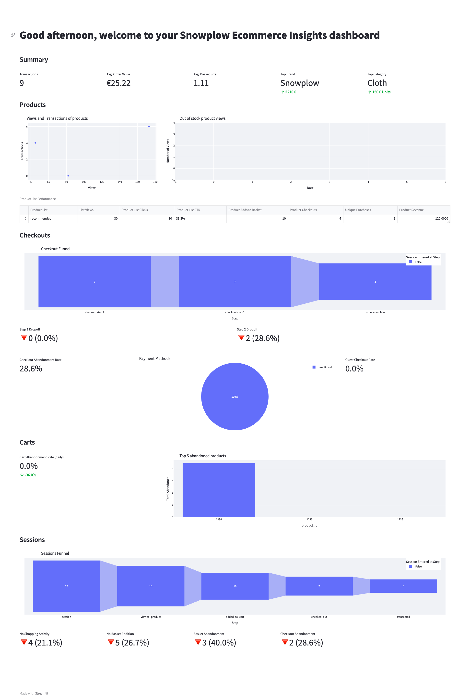

+++
title = "Ecommerce Web Accelerator"
menuTitle="Introduction"
chapter = false
weight = 1
post = ""

aliases = [
    "/en/",
    "/en/introduction/"
]
+++

#### Introduction

Welcome to the **Ecommerce Web** accelerator. Once finished, will have all the required tracking and data infrastructure to measure customer behavior, discover new growth opportunities and optimize your online sales performance.

Here you will learn to:

- Set up the required ecommerce tracking on your website
- Model and Visualize Snowplow data
  - using the [snowplow-web](https://hub.getdbt.com/snowplow/snowplow_web/latest/) dbt package and Streamlit
  - using our sample data for Snowflake (no need to have a working pipeline)
- Apply what you have learned on your own pipeline to gain insights

---

#### Who is this guide for?

- Data practitioners who would like to get familiar with Snowplow data.
- Data practitioners who want to learn how to use the snowplow-web dbt package and set-up tracking on their ecommerce store, to learn more about visitor and customer behavioural data as quickly as possible.

---

#### What you will learn

In approximately 2 working days (~13 working hours) you can achieve the following:

- **Track -** Set up ecommerce actions tracking on your store
- **Upload data -** Upload a sample Snowplow events dataset to your Snowflake warehouse
- **Model -** Configure and run the snowplow-web data model
- **Visualize -** Visualize the modeled data with Streamlit
- **Enrich -** Add enrichments to your data
- **Next steps -** Gain value from your own pipeline data through modeling and visualization


gantt
dateFormat HH-mm
axisFormat %M
section 1. Track
2h :track, 00-00, 2m
section 1. Upload
1h :upload, after track, 1m
section 3. Model
1h :model, after upload, 1m
section 4. Visualize
1h :visualize, after model, 1m
section 5. Enrich
1h :enrich, after visualize, 1m
section 6. Next steps
2h :next steps, after enrich, 2m



---

#### Prerequisites

**Modeling and Visualization**

- dbt CLI installed / dbt Cloud account available
  - New dbt project created and configured
- Python 3 Installed
- BigQuery account and a user with access to create schemas and tables

**Tracking and Enrichment**

- Snowplow pipeline
- Online store to add the tracking code

{}
Please note that the snowplow-ecommerce package currently only support BigQuery, but further adapter support is coming soon!
{}

#### What you will build

Ecommerce Dashboard - with Streamlit or Looker



{}

{}

{}


